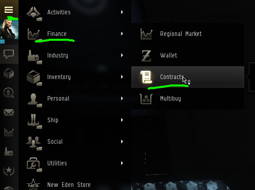
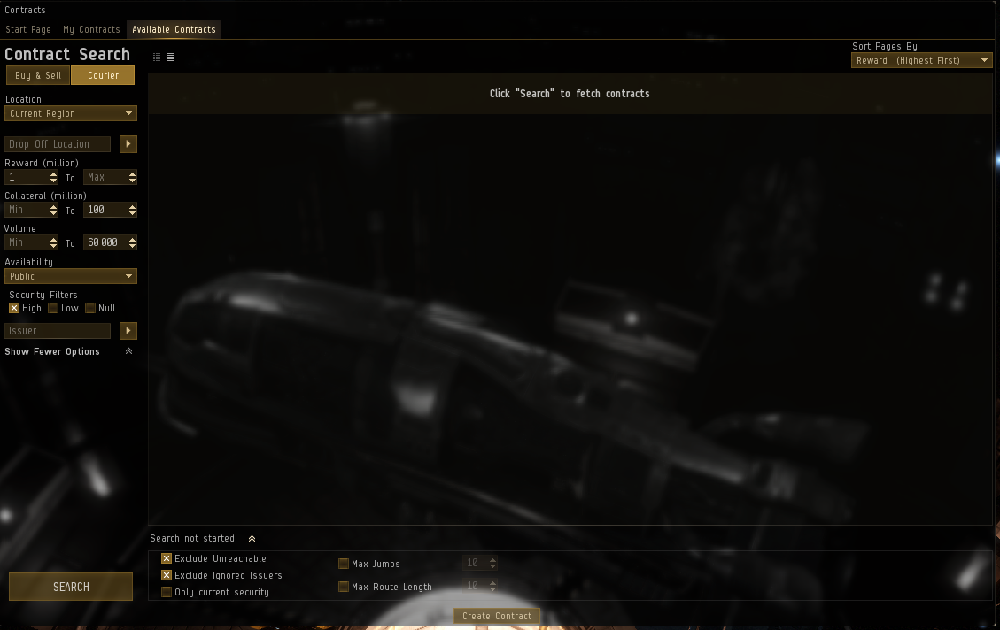
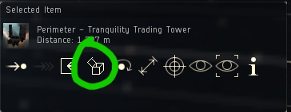

# Haulers Guide #
#### A written guide to hauling in EVE Online
   

### Finding contracts
You'll find the contracts window under the neocom menu under Finance.

 
 

You'll find courier contracts under the **Available Contracts** tab followed by clicking the **Courier** button.

Make sure to show more options and set the options to what you're looking for.  
Note that collateral is given in millions of ISK, not just ISK.

Below the search window you have a small arrow-shaped button with further options hidden allowing you to Exclude Unreachable and Exclude Ignored Issuers.  
Excluding unreachable is a bit miffy and doesn't always work but generally it hides most stations that don't have docking rights for you to pick up the package.  
Excluding ignored issues will allow you to ignore scammers so you don't see them in the future!

 

### Haulers channel
There is an in-game chat channel called **Haulers Channel** that you should definitely join if you want to be a hauler.  
This is where just about every serious trader will post their public contracts.  
It is also where haulers hang out to chat, help eachother and warn about gate camps, scammers and other dangers.

The channel is moderated by very talented players in order to keep the quality of the content relatively high.

Many contracts might be out of your league as a newbiew hauler, but there are even traders in there creating contracts specifically for new players. So have patience and hang in there!

The channel was created by Rita Jita and you can find an interview with him [over here](https://www.youtube.com/watch?v=oNfBf7Sfw0A)

 

### Private citadels
It used to be the case that we ignored all contracts to and from just about every private structure as a common scam was to remove docking rights before you could finish your delivery and thereby being forced to fail the contract and pay the collateral.

Nowadays you can deliver TO private structures even if you can't dock thanks to the introduction of Cargo Deposits.  
If you can't dock at a station, you can open your Cargo Deposit by selecting the station in your overview and clicking the button in the Selected Item window:

Or by right-clicking the structure either in your overview or in space.

---
>**NOTE**
>You can only deliver **TO** a cargo deposit, **NOT** from.

---

Even if you're able to unload your cargo into the cargo deposit, remember that it might leave your ship vulnerable while doing so and then having to align and warp out.  
If you're delivering to a private station in lowsec then this will give plenty of time for gankers to lock on to you.

If a contract has a private station as a pickup place, you should always dock in that station before accepting the contract.  

 

### Collateral

The collateral is there to make sure you as a hauler don't steal the cargo.  
It is withdrawn from your wallet directly upon accepting a contract and returned to you once you finish the contract successfully.  

The cost of ganking you will be higher the more effective health points (ehp) your ship has.  
A general rule of thumb that's commonly given for trying to be a bit safer in high sec is therefor to carry about 100 mil of collateral per 11k ehp.

Although not everyone will abide to it, a good collateral should be about 110%-115% of the cargo value.  
The purpose of the collateral after all is to reimburse the lost goods, not to make a profit, and having a much higher collateral than cargo value can be a sign of a scam contract.

Needless to say, the more collateral you can put up the more the reward will be.

 

### Spotting scam contracts

Scam contracts are set up in a way to make you very likely, or even guaranteed, to fail the contract.  

Some common warning signs can be

* Pick-up place is in a station where you can't dock.
* The reward is very low and the collateral very high.
* The reward is unjustifiably high.
* The player's contract history is full of failed courier contracts.

 

### What's a good contract?

A good rule of thumb to judge whether or not a contract has a good reward is one million in reward per billion collateral per jump.

Meaning, if a contract has a 2 billion ISK collateral and the route is 10 jumps then the reward should be at least

2 mil * 10 = 20 million ISK

Other factors also come into play, such as the size of the cargo (does it fit in a DST? Does it need a freighter? BR? JF?), the risk of the route, if it's between major trade hubs, etc.

As a new hauler building your skillset and wallet you'll probably have to lower your standards a  bit though.