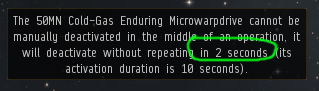

# Haulers Guide #
#### A written guide to hauling in EVE Online
<br>  

## Deep Space Transports

Deep Space Transport ships are the daily drivers for most haulers and I would say that it's when you start flying a DST that you will see the money start to come in in a steady stream.

DSTs are popular because they can carry up to 62,500m3 (with **Transport Ships V** trained) and fit a very high tank, i.e effective hp, for their size.

#### Training Time

Training into DSTs takes a minimum of about 30 days with an additional 6 days to get **Transport Ships** to level 4.


#### The Fleet Hangar
DSTs are a little special in that they have a small regular cargohold but a fairly big Fleet Hangar.  
The cargo capacity of the Fleet Hangar scales not with fittings but with your **Transport Ships** skill.

Most haulers only bother with training **Transports Ships** up to level 4, and therefor most DST contracts stay below 60,000m3.

<br>

### Ships

The following Deep Space Transport ships are available in the game:

* Impel (Amarr)
* Bustard (Caldari)
* Occator (Gallente)
* Mastodon (Minmatar)

<br>

### Fittings

**TODO**

<br>

### Cloak + MWD trick

The Cloak + Microwarpdrive trick is a clever use of game mechanics that allows your DST to align and accelerate while cloaked and then jump into warp immedietly as you decloak.

It works like this:

1. Click **Align to** on your overview.
2. Activate your cloaking device.
3. Activate your microwarpdrive.
4. Spam your microwarpdrive button. This will display an error message with a countdown timer.  
   When this timer shows 2, deactivate your cloak.
5. Click **Warp to** on your overview.

If you put your cloak on your F1 key and your microwarpdrive on your F2 key, it'll go like this:

1. Align to
2. Hit F1 immedietly followed by F2.
3. Spam F2 until the timer shows 2 seconds.
4. Hit F1 and click Warp To.

For the sake of completing the trick, it doesn't really matter if you hit the cloak or the mwd first so no need to panic if the server lags and your mwd activates before the cloak, just hit cloak again.  
However, you of course want to try and get the cloak in first to reduce the time an attacker has to target you.  
Activating the MWD will also increase your signature radius, which will make you easier to target.

<br>

This is where to look



You have a window to hit it that's larger than when the timer shows 2 seconds, but I find that doing it with 2 seconds left always makes for good timing, so it's just playing it somewhat safe.

---

**TIP** When you want to use an insta dock bookmark while doing the Cloak+mwd trick, align as usual and enable cloak and mwd. Then either right in space or in your Places window and hover your mouse over the **Warp to within 0m** option as usual. You will still be able to spam F2 without the menu closing until you click it.

---

Have a look at this instructional video for a step by step visual explanation.

[](https://youtu.be/_i78dAwjyu8)

<br>

### Collateral

If you have a tanky fit and you can perform a consistently perfect Claok + MWD trick in your sleep then you can fairly safely ship any collateral you feel comfortable with in a DST.

<br>

### DSTs and Low Sec

Some DST pilots do shipments to low sec systems in their DSTs.  
If you decide to do this you need to be aware that the cost of ganking you is zero. A single frigate can kill you if you're unlucky.

Therefor, should you decide you want to ship to low sec and you're carrying a somewhat valuable load, I would recommend using another character to scout ahead of you.

Also use that character to create bookmarks to insta dock and undock on the station you're going to.

<br>

### Minimum skills

These are the bare minimum skills needed to get into a Deep Space Transport.  
This example uses an Amarr character.

```
Amarr Industrial II
Amarr Industrial III
Amarr Industrial IV
Amarr Industrial V
Industry II
Industry III
Industry IV
Industry V
Transport Ships I
```

**Total training time**: 29 days, 15 hours and 15 minutes.