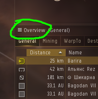
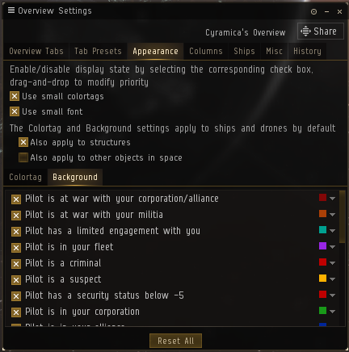
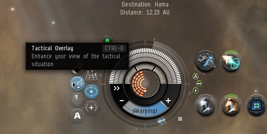

# Haulers Guide #
#### A written guide to hauling in EVE Online
   

## Hauling essentials
Hauling is great fun! But just like the rest of EVE, there can be a bit of a steep learning curve.
Here are some things you should know about before you get started! 

### Training time
At the start of your hauling career the ships you'll be able to fly will be easy to blow up and won't hold much cargo.  
Training to get into more advanced ships will take weeks or even several months, and training to fly them at their most efficient could even take years.

Because EVE is designed towards doing other activities in the game, such as PvP or industry, there aren't that many opportunities for training to become a hauler given by the developers.  
This means you'll have to learn a lot on your own and getting the ISK for skills, ships and contract collaterals can be a bit slow at the start of your career.

That doesn't mean you can't have fun being a space truck from the get-go, though! It's just something you should be aware of.

 

### Risk / Reward

Earning money as a hauler can be a bit difficult when you're just starting out.  
A lot of contracts require high collateral or high cargo space, but there are plenty contracts for new haulers as well! If you join the **Haulers Channel** channel in-game, some contractors even go out of their way to create contracts specifically for new haulers.

A common motto in EVE is "Don't fly what you can't afford to lose" and this is even more true for Haulers because if you get blown up you'll not only have to replace your ship but you will lose the collateral and you'll have to find funds to afford collaterals for your next contract so you can keep on earning.

So say you lose your 200 million ISK Deep Space Transport while carrying freight with a 1 billion ISK collateral.

200 million for the ship that got blown up.
200 million for the next ship you buy to replace it.
1 billion for the collateral of the failed contract.
1 billion for the next contract to get started earning again.

So if you want to keep hauling, make sure you have enough to start earning after you get blown up before you accept a contract.

 

### Insta dock / undock bookmarks
**Insta docks**  
When you warp to a station you'll usually land just outside of its docking range and have to slowly approach it giving potential gankers time to scan you and blow you up.
To avoid this you can create an insta dock bookmark when you undock so that you bookmark is as close to the hangar as possible

**Insta undocks**
Insta undock bookmarks are bookmarks located some 150km+ straight out from a station's undock making so that your ship is already aligned and at full speed when you leave the hangar and you're able to warp off very quickly.

For most stations you do not want to warp to an insta undock bookmark as an enemy gang could potentially catch up with you if they're somewhat prepared.  
A safer way to undock in most stations is to simply undock and start aligning without hitting warp. If trouble shows up you simply dock again since you'll still be in range, and if instead everything goes well and you're able to jump to warp then you're all good.

If however the station undock is very crowded so you keep getting bumped (Jita 4-4 for instande) or you need to warp in the opposite direction from the undock so you keep bumping into the station before you can enter warp then an undock can be very useful.

Having an undock has saved my life countless times when campers have been waiting for me to undock.  
 
Make a habit to create insta docking bookmarks every time you undock from a station where you haven't made a bookmark previously, and **take the time to get both docking and undocking bookmarks for at least the main trade hubs**.

 

### Corporations and war declarations
Joining a player run corporation can be dangerous for a hauler.
If the corporation owns any sort of structure in space it will be eligible for war declarations which means that players who's corps have declared war on yours are allowed to blow you up in high sec space without any repercussion.

 

### Ransoms

Should someone try and hold you to a ransom while bumping your ship, camping the station you're in or the jumpgate you just got through there is one simple thing you should do: Nothing.

Do not talk to them, do not accept invitations to conversations. 

#### **Do not under any circumstance pay the ransom!**

If you do, all that's gonna lead to is you losing both your ship and the ransom instead of just your ship.

 

### Overview settings
**TODO**

You can change your Overview settings by clicking on this button here

I suggest you add a tab with just jumpgates and stations so that you can filter out all the "noise" such as ships, mobile depots, etc. at popular destinations and makes finding your waypoint easier.

You could also add a tab that shows just stations and ships or just stations and ships that are likely to be used for bumping and so on.

Play around a bit with it while flying to see what you like.

One really useful setting though is to enable a backkground colour for other pilots.  
That way you will see really easily when there's other ships around you and you might have to be extra careful or expect some extra lag while doing the cloak+mwd for instance.

  

### Client settings

Make sure your client is set to reject all invitations to duel:

  

Set your route planner to always prefer high sec space:

  

Enable tactical overlay to be able to see distances, your alignment and more.

