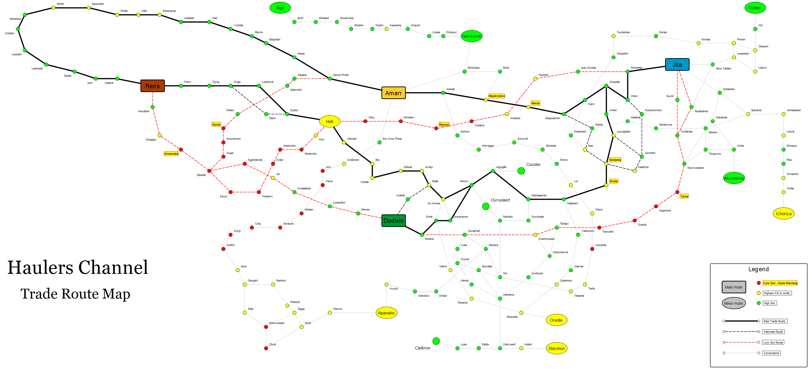

# Haulers Guide #
#### A written guide to hauling in EVE Online
   

## Trade routes
Shipments going between major trade hubs are often slightly cheaper because the chance of being able to pick up another contract going back is higher.

 

